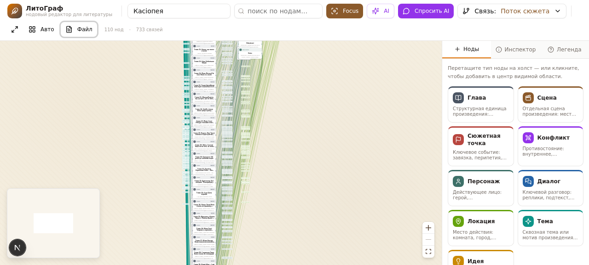

# LitGraph Desktop

> Нодовый редактор для работы с литературным текстом — десктопная версия для Linux.
> Построена на **Tauri 2 + React + TypeScript + Rust**.



## Что это

LitGraph — визуальный редактор, в котором сюжет, персонажи, локации, темы и сцены
представлены в виде нод, соединённых связями. Похоже на нодовый редактор в игровых
движках (Unreal Blueprints) или в AI-генераторах картинок (ComfyUI) — но для
литературы.

**Веб-превью** (для совместной работы с AI в песочнице) живёт отдельно.
Эта репа — десктопная версия, которая работает локально без интернета.

## Возможности

- **9 типов нод**: Глава, Сцена, Сюжетная точка, Конфликт, Персонаж, Диалог, Локация, Тема, Идея
- **9 типов связей**: поток сюжета, причина-следствие, участие персонажа, место действия, упоминание, конфликт, предзнаменование, альтернативная ветка, тема
- **Focus-режим**: при клике на ноду остальные затемняются
- **Полный текст главы**: чтение и редактирование прямо в редакторе
- **Версионирование**: сохранение/откат/удаление версий глав (до 50 на ноду)
- **Автопарсер .md**: загружаешь любой .md → получаешь готовый граф
- **AI-функции** (3 шт.):
  - AI-помощник — чат с контекстом графа
  - Дописать главу — генерация продолжения
  - Анализ сюжета — поиск слабых мест
- **AI-провайдеры на выбор**: Ollama (локально, бесплатно) / OpenAI-совместимый API / Z.ai
- **Экспорт**: JSON / текст / Markdown

## Стек

| Слой | Технология |
|------|-----------|
| Desktop-обёртка | Tauri 2 |
| Frontend | React 19 + TypeScript + Vite |
| Нодовый холст | @xyflow/react (React Flow) |
| State | Zustand + persist |
| Стили | Tailwind CSS 4 + shadcn/ui |
| Backend | Rust |
| AI | Ollama / OpenAI-compat / Z.ai |

## Статус проекта

🚧 **В разработке**. Сейчас в репозитории:
- Промпт-план разработки (12 этапов, ~15-18 дней)
- Скриншоты прототипа
- Скелет Tauri-проекта (готов к разработке)

Следующий шаг — реализация этапов из `docs/PROMPT_PLAN.md`.

## Быстрый старт (для разработчиков)

### Зависимости

**Linux (Ubuntu/Debian):**
```bash
# Rust
curl --proto '=https' --tlsv1.2 -sSf https://sh.rustup.rs | sh

# Tauri системные зависимости
sudo apt update
sudo apt install -y libwebkit2gtk-4.1-dev build-essential curl wget file \
  libxdo-dev libssl-dev libayatana-appindicator3-dev librsvg2-dev

# Node.js 20+
curl -fsSL https://deb.nodesource.com/setup_20.x | sudo -E bash -
sudo apt install -y nodejs
```

### Запуск дев-режима

```bash
git clone https://github.com/Kotokvit/litgraph-desktop.git
cd litgraph-desktop
npm install
cargo tauri dev
```

### Сборка релиза

```bash
cargo tauri build
# Результат: src-tauri/target/release/bundle/{deb,appimage}/
```

## Структура проекта

```
litgraph-desktop/
├── src-tauri/              # Rust backend
│   ├── src/
│   │   ├── commands/       # Tauri commands (invoke из JS)
│   │   ├── parser/         # Автопарсер .md
│   │   ├── models/         # Типы данных
│   │   ├── storage/        # Работа с файлами проектов
│   │   └── ai/             # AI-провайдеры (Ollama, OpenAI-compat, Z.ai)
│   └── tauri.conf.json
├── src/                    # React frontend
│   ├── lib/litgraph/       # types, store, export (из прототипа)
│   └── components/
│       ├── litgraph/       # 11 компонентов (из прототипа)
│       └── ui/             # shadcn/ui
├── docs/
│   ├── PROMPT_PLAN.md      # Подробный промпт-план разработки
│   └── screenshots/        # Скриншоты прототипа
└── .github/workflows/      # CI: сборка .deb/.AppImage при релизе
```

## AI-провайдеры

Приложение поддерживает 3 способа работы с AI:

### 1. Ollama (по умолчанию, бесплатно, офлайн)

```bash
# Установить Ollama
curl -fsSL https://ollama.com/install.sh | sh

# Скачать модель
ollama pull llama3.1
# или для лучшего качества:
ollama pull qwen2.5:14b

# Запустить сервер
ollama serve
```

В настройках приложения выбрать Ollama, указать URL `http://localhost:11434`.

### 2. OpenAI-совместимый API

Работает с: OpenAI, Groq, OpenRouter, Together AI, LiteLLM, vLLM, и любым другим
сервером с OpenAI-совместимым API. В настройках указать endpoint, API key, model.

### 3. Z.ai (опционально)

Через OpenAI-совместимый endpoint Z.ai. Нужно получить доступ к API.

## Лицензия

MIT — открытый исходный код, любой может пересобрать под себя.

## Ссылки

- **Промпт-план разработки**: [`docs/PROMPT_PLAN.md`](docs/PROMPT_PLAN.md) — подробный план на 12 этапов
- **Скриншоты прототипа**: [`docs/screenshots/`](docs/screenshots/)
- **Превью-версия** (веб, для совместной работы с AI): отдельная ссылка

## Автор

Kotokvit
